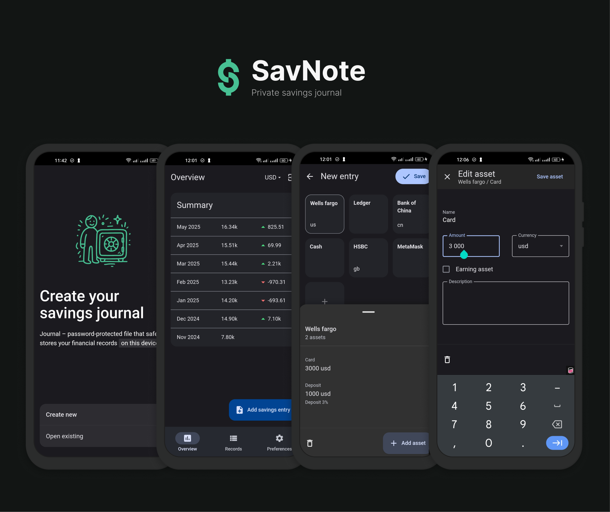

  

# ⚠️ UNDER DEVOLOPMENT
App is on the early stage of development. Currently not available for use. Star project if you are interested – this will motivate me to work harder. Contributions are welcome – reach out to me by opening an issue.

# SavNote – Private Savings Journal
SavNote is an open-source app for tracking your personal savings.

How it works:
1. Record your initial savings balances in each institution (e.g., bank, broker, cryptocurrency wallet) and currency.
2. Update your balances at regular intervals (monthly or less often) by recording only the changes since the last update.
By only recording the changes, you can quickly and easily update your savings records without having to re-enter all of your information each month.
3. SavNote will store your records and provide a clear overview of your savings.

Features:
- Summary trend
- Total value in chosen currency
- Breakdown of savings by currency
- Geographic distribution of savings (by country)
- Distribution of savings across institutions (banks, brokers, or cryptocurrency wallets)
- Earning assets to total assets ratio

## Core Values
*SavNote* is built on the following core values:
* **Data ownership**: You have full control over your data, which is stored locally on your device. Your savings data remains accessible even if you uninstall the app, and you can use it independently of *SavNote*.
* **Data privacy**: Your data is encrypted and protected by a password, ensuring that only you can access it.
* **Android-first**: Android-centric design, focusing on delivering a seamless and intuitive mobile experience.
* **Extensibility**: SavNote is fully open-source, empowering you to extend, customize, and modify it to fit your needs. With a cross-platform foundation, you're also free to fork and adapt it for other platforms.

## Project Vision  
Read more about vision of SavNote in [VISION.md](VISION.md).

## Contributing
Contributions are welcomed. At the moment, best way to start is to create an issue with your suggestions and ideas.

See [Contributing guide](/CONTRIBUTING.md) for more details.
