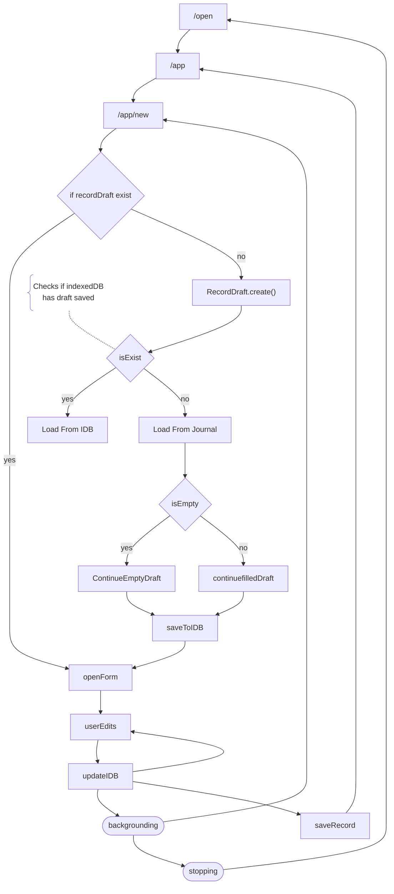

```mermaid
flowchart TD
    /open --> /app
    /app --> /app/new
    /app/new --> ifRecordDraftExist{if recordDraft exist}
    create --> isExist{isExist}
   
    comment1@{ shape: comment, label: "Checks if indexedDB 
    has draft saved" }
    comment1 -.- isExist 

    isExist -- yes --> loadIDB[Load From IDB] 
    isExist -- no --> loadJ[Load From Journal]

    loadJ --> isEmpty{isEmpty}
    isEmpty{isEmpty} -- yes --> ContinueEmptyDraft
    isEmpty{isEmpty} -- no --> continuefilledDraft
    
    ifRecordDraftExist -- yes --> openForm
    ifRecordDraftExist -- no --> create["RecordDraft.create()"]

    continuefilledDraft --> saveToIDB
    ContinueEmptyDraft --> saveToIDB

    saveToIDB --> openForm
    openForm --> userEdits
    userEdits --> updateIDB
    updateIDB --> userEdits
    updateIDB -->  backgrounding([backgrounding])

    backgrounding --> /app/new
    backgrounding --> stopping([stopping])
    stopping--> /open
    updateIDB --> saveRecord
    saveRecord --> /app

```